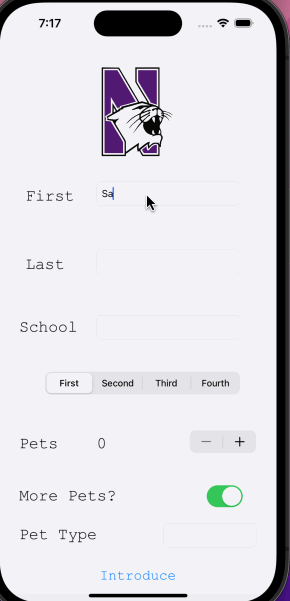

## SAFIYA'S INTRODUCTION

### App Description

This app allows the user to type in and adjust facts about themselves, and when they click the introduce button, a message with all of their introductory information will appear on the screen.

### App Walk-though

   

### Required Features

- [ x] 1. App displays an image of a school's logo
- [ x] 2. App has three textfields for first, last, and school names
- [ x] 3. App has a segmented control that changes student year
- [ x] 4. Number of pet matches label is increased/decreased by stepper
- [ x] 5. Switch makes a statement about wanting more pets or not(true/false) 
- [ x] 6. Introduce yourself button shows alert box with an introduciton and dismiss button

### Optional Features

- [ ] 1. User can tap a button to change the color of the background view
- [X ] 3. User can select on additional buttons that provide more info about the user. (Created a new text field for type of pet that was added in the  introduction message)
- [ x] 4. Any stylistic changes that are not default options (Changed background color, font size, and font type)# INTRODUCTION

